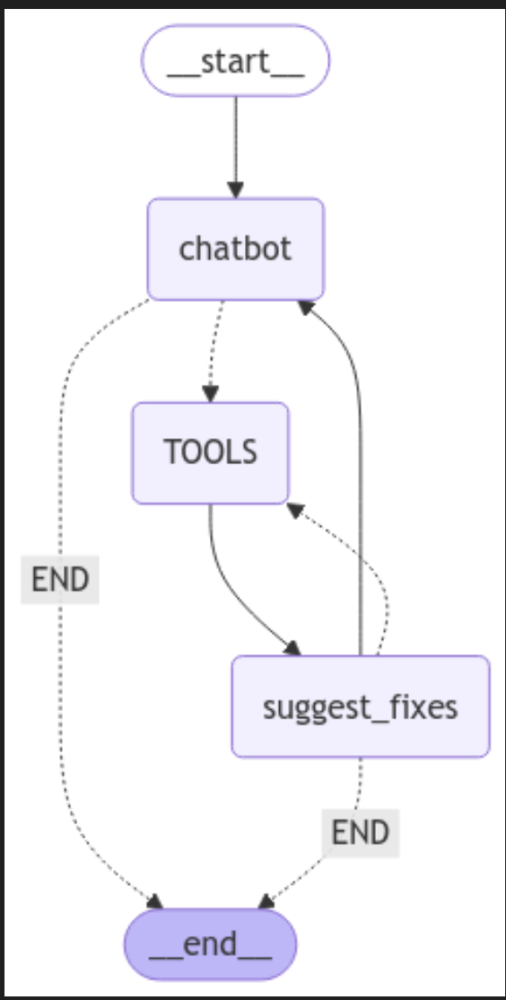

# BigQuery Agents

This project implements a conversational agent powered by LangGraph and Google Vertex AI's Gemini model to troubleshoot BigQuery jobs. It utilizes custom tools to fetch job details and table schemas, enabling the agent to provide informed suggestions for fixing errors.

## Scripts
- bq_fix is an AI agent uses Gemini 2.0 Flash. Agent suggests fixes to a problematic query by getting Bigquery job id from user. It uses BigQueryJobDetailsTool and BigQueryTableSchemaTool to get the query and error text and suggests some resolutions. If the error includes data type related ones, it uses BigQueryTableSchemaTool tool to get the table schema for more accurate suggestions.
- bq_fix_basic is a basic version which does not have the schema lookup functionality. can be useful to resolve syntax issues but not that efficient if the error is related to a column data type compared to bq_fix.

## Features

-   **BigQuery Job Details Retrieval:** Fetches details of a BigQuery job, including the query and any error messages.
-   **BigQuery Table Schema Retrieval:** Retrieves the schema of a BigQuery table, including column names and data types.
-   **Error Analysis and Fix Suggestions:** Analyzes job details and errors to suggest possible fixes, leveraging table schema information when necessary.
-   **Conversational Interface:** Allows users to interact with the agent through a command-line interface.
-   **LangGraph State Management:** Uses LangGraph to manage the conversation flow and state, including messages, job details, and table schemas.
-   **Mermaid Graph Visualization:** Generates a Mermaid diagram of the LangGraph flow, saved as `graph.jpg`.

## Prerequisites

-   Python 3.12+
-   Google Cloud Platform (GCP) account with BigQuery enabled
-   `PROJECT_ID` environment variable set to your GCP project ID or hardcoded in the script.
-   Poetry for dependency management

## Installation using pip
1.  Install the pypi package:

    ```bash
    pip install bigquery_agents
    ```

## Installation via Github

1.  Clone the repository:

    ```bash
    git clone https://github.com/samkaradag/bigquery-agents.git
    cd bigquery-agents
    ```

2.  Install dependencies using Poetry:

    ```bash
    poetry install
    ```


## Usage

1.  Set your GCP project ID:

    ```bash
    export PROJECT_ID="your-gcp-project-id"
    ```
    Or change the PROJECT_ID variable inside the python script.

2.  Authenticate with GCP:

    ```bash
    gcloud auth application-default login
    ```


3.  Run the agent using the `bq_fix`:

    ```bash
    bq_fix
    ```


